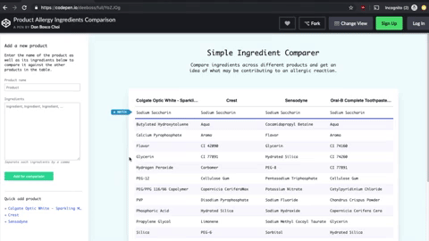

# Ingredients Comparer

This is a super simple ingredients comparer to let you find the shared ingredients across multiple products.

Built over a weekend on a whim after hearing about the needs of a friend with a recent allergic reaction to toothpaste.

Could be used for things like:
1. **Allergen information**: Compare the active ingredients of different products to see if there may be a commonly shared ingredient that is causing an outbreak or rash.
2. **Ideas for leftovers**: Compare several recipes to see what ingredients are needed for all of them.

_More coming soon_